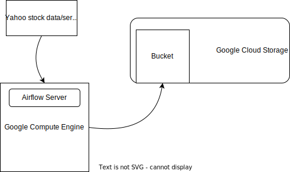

# Data Engineering : ETL on GCP

## Compute Engine

Create a compute engine and enable storage related API.

### Setup (linux only)
Reinstall python3-pip
1. `sudo apt remove python3-pip`
2. `sudo apt-get install apt-transport-https`
3. `sudo apt install python3-pip`
4. `sudo pip install pyopenssl --upgrade`

install the python packages using 
- Clone this repository and `cd` into it.
- `pip install -r requirements.txt`
- `export AIRFLOW__CORE__DAGS_FOLDER=$(pwd)/dags/`
- `airflow standalone`
- Note down the login credentials displayed

### Storage
Create a storage bucket of the name `yahoo_stock_airflow_bucket` under Cloud Storage

## Execute DAG

Find the external IP of the computer engine and open the browser with `IP:8080` since airflow is running on port 8080 by default. Login using your credentials from before. Then find the yahoo dag and trigger it.